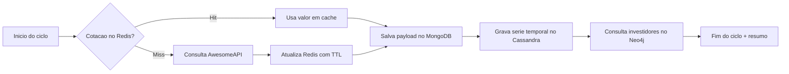

# FastAPI NoSQL Demo (Redis, MongoDB, Cassandra, Neo4j)

Demo academica para a disciplina de banco de dados nao relacional.

## Objetivo

Servidor FastAPI que implementa as 4 tarefas da plataforma de inteligencia de mercado:

1. Redis para cotacao atual com baixa latencia (cache hit/miss).
2. MongoDB para Data Lake com payload bruto e data_coleta.
3. Cassandra para serie temporal por moeda.
4. Neo4j para rede de investidores e consulta de alertas.

A API utilizada e a de mercado tradicional da AwesomeAPI:

- https://economia.awesomeapi.com.br/last/USD-BRL,EUR-BRL

## Estrutura

- app/core: settings e logging
- app/db: conectores separados por banco
- app/services: provedor de mercado, ingestao, scheduler e seed com Faker
- app/api: rotas FastAPI
- tests/integration: testes de integracao com reset simples das bases

## Requisitos

- Python 3.11+
- uv - https://docs.astral.sh/uv/getting-started/installation/
- Docker + Docker Compose

## Subir bancos

```bash
docker compose up -d
```

## Ambiente Python com uv

```bash
uv venv
source .venv/bin/activate
uv sync
```

Opcional para compatibilidade com o enunciado:

```bash
uv pip install -r requirements.txt
```

## Rodar servidor FastAPI

```bash
uv run uvicorn app.main:app --host 0.0.0.0 --port 8000 --reload
```

Swagger e teste da api:

- http://localhost:8000/docs

## Endpoints principais

- GET /saude
- POST /monitoramento/executar-ciclo
- GET /tarefa-1/cache/{simbolo}
- GET /tarefa-2/datalake/ultimos?simbolo=USD-BRL&limite=10
- GET /tarefa-3/serie-temporal/ultimos?simbolo=USD-BRL&limite=10
- GET /tarefa-4/alertas/{simbolo}

## Testes de integracao

Com os containers ativos:

```bash
uv run pytest tests/integration -v
```

### Reset de bases nos testes

- Redis: flushdb
- MongoDB: drop da collection
- Cassandra: truncate da tabela
- Neo4j: limpeza dos nos e relacionamentos de alerta

## Variaveis de ambiente

Copie .env.example para .env e ajuste se necessario.

Valores default recomendados:

- POLL_INTERVAL_SECONDS=20
- REDIS_TTL_SECONDS=45

## Observacoes

- O loop de monitoramento roda automaticamente no startup do FastAPI (MONITOR_ENABLED=true).
- Para demonstracao controlada, use POST /monitoramento/executar-ciclo.
- O arquivo monitor.py existe para compatibilidade com o formato pedido no enunciado.

## Como a aplicacao funciona

### 1) Ciclo de vida da API (startup e shutdown)

Quando o servidor FastAPI sobe, o ciclo de vida executa as etapas abaixo:

1. Cria o container de dependencias da aplicacao (repositorios e servicos).
2. Conecta com Redis, MongoDB, Cassandra e Neo4j.
3. Garante schema inicial no Cassandra (keyspace/tabela).
4. Executa seed inicial de investidores no Neo4j.
5. Inicia o scheduler em background (se MONITOR_ENABLED=true).

No encerramento da aplicacao, o scheduler e parado e todas as conexoes sao fechadas de forma ordenada.

### 2) Loop intermitente em background

O monitoramento continuo acontece por um scheduler assincromo que roda durante todo o tempo de vida da aplicacao:

- Executa um ciclo completo de monitoramento.
- Aguarda o intervalo configurado em POLL_INTERVAL_SECONDS.
- Repete continuamente ate receber sinal de parada.

Mesmo quando ocorre erro em um ciclo, o loop nao derruba a API: o erro e logado e o proximo ciclo segue normalmente.

### 3) Fluxo de um ciclo de monitoramento

Cada ciclo segue o mesmo pipeline:

1. Redis: verifica cache por moeda (hit/miss).
2. AwesomeAPI: em caso de miss, busca cotacoes e atualiza Redis com TTL.
3. MongoDB: salva payload bruto no Data Lake com data_coleta.
4. Cassandra: grava ponto na serie temporal (historico_precos).
5. Neo4j: consulta investidores que acompanham a moeda e registra ultima_notificacao.

Fluxo resumido:



### 4) Como cada rota funciona

- GET /saude
	- Verifica conectividade com os 4 bancos e retorna status agregado.

- POST /monitoramento/executar-ciclo
	- Executa um ciclo manual sob demanda.
	- Aceita forcar_consulta_api=true para ignorar cache e sempre buscar na API.

- GET /tarefa-1/cache/{simbolo}
	- Primeiro tenta Redis.
	- Se nao encontrar, consulta AwesomeAPI, salva no Redis com TTL e retorna o valor.

- GET /tarefa-2/datalake/ultimos
	- Consulta os ultimos documentos salvos no MongoDB.

- GET /tarefa-3/serie-temporal/ultimos
	- Consulta os ultimos pontos da serie temporal no Cassandra.

- GET /tarefa-4/alertas/{simbolo}
	- Retorna investidores que acompanham a moeda no Neo4j.

### 5) Conceitos tecnicos abordados

- Persistencia poliglota:
	- Cada banco e usado para o que faz melhor.

- Cache-aside no Redis:
	- Leitura tenta cache primeiro; miss busca origem e atualiza cache.

- Data Lake no MongoDB:
	- Armazenamento do payload bruto para auditoria e rastreabilidade.

- Serie temporal no Cassandra:
	- Escrita orientada a consulta por moeda e data de coleta.

- Grafo de relacionamentos no Neo4j:
	- Relacao Investidor -> Moeda para alertas.

- Contrato de API com DTOs Pydantic:
	- Request/response explicitos, melhorando qualidade do OpenAPI/Swagger.
